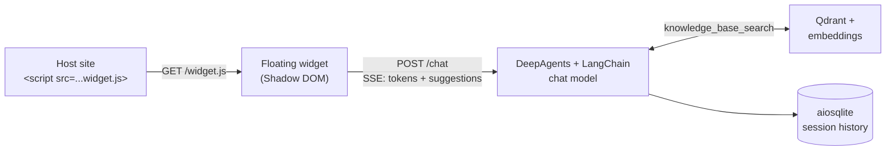

# Plugin RAG Agent

Self-hosted, plug-and-play RAG chatbot that drops into any website with
one `<script>` tag. FastAPI + DeepAgents + Qdrant + your choice of LLM
backend; Shadow-DOM widget with token-streamed answers, follow-up chips,
and per-session history.



## Quickstart

```bash
git clone <repo> plugin_rag && cd plugin_rag
cp config/.env.example config/.env
# Edit config/config.yaml (system_prompt + widget.*) and drop your
# knowledge-base markdowns into ./data/
docker compose up --build
```

Stack: `qdrant` + `api`. Plugin RAG does **not** bundle a local LLM
server. If your config uses `ollama:*` models, run your own Ollama (or
llama.cpp / vLLM / LM Studio) and set `OLLAMA_HOST` in `.env`:

```bash
ollama serve &
scripts/setup_ollama.sh   # pulls every ollama:* model from config.yaml
```

On boot the api verifies API keys / Ollama models / data folder, ingests
once, then starts uvicorn on `:8000`.

```
http://localhost:8000/demo       # floating widget on a sample host page
http://localhost:8000/chat-ui    # standalone full-window chat
http://localhost:8000/health/ready
```

Re-ingest after editing `data/`:

```bash
docker compose run --rm api ingest --recreate
```

Reset modes for fresh starts:

```bash
RESET=1 docker compose up      # wipe chat history + drop+rebuild qdrant
REINGEST=1 docker compose up   # drop+rebuild qdrant (keep chat history)
```

## Embedding on a host site

```html
<script src="https://chatbot.example.com/widget.js" async></script>
```

Script attributes:
- `data-backend="https://other.example"` - cross-origin backend
- `data-mode="embed"` - render full-window, no floating bubble

### Colour scheme

Default comes from `widget.primary_color` in `config.yaml`. Host sites
can override per-page via query params on `/widget.js`:

```html
<!-- preset -->
<script src="/widget.js?theme=ocean"></script>

<!-- explicit hex (URL-encode the #) -->
<script src="/widget.js?primary=%230e7490&secondary=%23213a51&tertiary=%238ecae6"></script>
```

Presets: `indigo` (default), `emerald`, `rose`, `amber`, `ocean`,
`slate`.

`primary` drives gradients and buttons. `secondary` is the gradient
endpoint. `tertiary` controls the pulse-ring aura and chip hovers. Any
slot you don't pass falls back to a derivation of primary. Bad values
are silently ignored.

## Switching use case

Same code serves any RAG use case. To switch domains, edit only:

1. `data/` - markdowns for the new domain
2. `agent.system_prompt` - persona + behaviour
3. `vector_store.tool_name` + `tool_description` - when-to-call hint
4. `widget.*` - branding

Re-run ingestion and restart. No Python changes.

## Switching LLM provider

```yaml
agent:
  model: openai:gpt-4o-mini    # or anthropic:..., google_genai:..., ollama:...
embeddings:
  model: openai:text-embedding-3-small
```

```bash
# config/.env
OPENAI_API_KEY=sk-...
# OPENAI_BASE_URL=...   # optional, for OpenAI-compatible endpoints
```

## Configuration reference

`config/config.yaml` is fully annotated. Top-level blocks:

| Block | Keys |
|---|---|
| `agent` | `model`, `temperature`, `model_kwargs`, `system_prompt` |
| `ingestion` | `model`, `max_chunk_chars`, `chunk_overlap_chars`, `restructure` |
| `embeddings` | `model` |
| `vector_store` | `collection`, `top_k`, `score_threshold`, `tool_name`, `tool_description` |
| `widget` | `title`, `subtitle`, `greeting`, `primary_color`, `secondary_color`, `tertiary_color`, `position`, `starter_questions` |
| `sessions` | `sqlite_path`, `history_window`, `ttl_hours` |
| `api` | `host`, `port`, `cors_origins` |
| `rate_limit` | `enabled`, `requests_per_minute` |
| `suggestions` | `enabled`, `max_items` |
| `logging` | `file`, `max_bytes`, `backup_count` |

Behind a reverse proxy: set `TRUST_PROXY=true` in `.env` so the rate
limiter honours `X-Forwarded-For`.

## API surface

| Method | Path | Purpose |
|---|---|---|
| GET  | `/health` | Liveness |
| GET  | `/health/ready` | Probes Qdrant + Ollama (when configured); 503 if any fails |
| GET  | `/widget.js` | Widget bundle (accepts `?theme=…&primary=…&secondary=…&tertiary=…`) |
| GET  | `/widget/settings` | Widget branding as JSON (same params) |
| GET  | `/chat-ui` | Standalone full-window chat page |
| GET  | `/demo` | Sample host page with the floating widget |
| GET  | `/chat/history?session_id=…&limit=50` | Replay a session's prior messages |
| POST | `/chat` | SSE stream (`token` / `suggestions` / `done` / `error`); rate-limited per IP |

## Repository layout

```
backend/
  rag/        agent, retriever, ingestion, middlewares
  server/     FastAPI app, routes, rate limit
  database/   SQLite session store
  config.py, utils.py
frontend/widget/   widget.js + chat-ui.html + demo.html
config/     config.yaml + .env (gitignored) + .env.example
data/       knowledge-base markdowns (gitignored)
storage/    sqlite + log + .ingested marker (gitignored)
scripts/    bootstrap.sh + setup_ollama.sh + try_chat.sh + try_agent.py
tests/      smoke + rate-limit tests
```

## Tests

```bash
pip install pytest
pytest tests/ -v
```

Smoke tests don't require Qdrant or Ollama. Helpers in `scripts/`
(`try_chat.sh`, `try_agent.py`) hit a running stack end-to-end.

## Contact

Built by Mohan Selvan. Reach out for questions, opportunities, or
collaboration:

- **Email:** mohanselvan.r.5814@gmail.com
- **LinkedIn:** https://www.linkedin.com/in/mohanselvan/
- **GitHub:** https://github.com/Mohan-Selvan
- **Portfolio:** https://moganaselvan-481fc.web.app

## License

See `LICENSE`.
