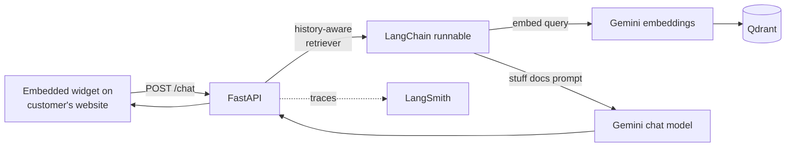

# Plug-in RAG Agent

A self-hosted AI support agent that drops into any website with a single script tag. Add one line of JavaScript to your site, point it at your own documents, and you have an AI assistant that answers customer questions grounded in your content. No frontend integration work required.

## TL;DR

Two halves:

1. **A one-line embeddable widget** that mounts a floating chat panel into any webpage. No build step, no framework, no design changes - it overlays cleanly on whatever site it's added to.
2. **A self-hostable RAG backend** that ingests your documents, retrieves the most relevant chunks per query, and answers with citations. Sessions, conversation memory, and rate limiting are built in.

You host the backend once, hand the widget snippet to the site owner, and the site has a working AI assistant within minutes.

## Embed it on a site

Once the backend is running (see *Setup* below), adding the chatbot to any website is one line:

```html
<script src="https://your-backend.example.com/widget"></script>
```

That snippet:

- Health-checks your backend.
- Injects a floating chat iframe into the bottom-right of the page.
- Connects it to your knowledge base.

No npm install, no build pipeline, no template changes. It works on plain HTML, WordPress, Shopify, framework-built apps - anything that allows a `<script>` tag.

A standalone chat UI is also available at `/chat-ui` if you prefer to host the chat as a dedicated page rather than a floating widget.

## What you get out of the box

- **Grounded answers.** Every reply is generated from chunks retrieved out of your own documents, not from the model's open-domain memory.
- **Conversation memory.** Each visitor gets a session with token-bounded history, so follow-up questions work naturally.
- **Rate limiting.** Per-session limits prevent abuse and keep cost predictable.
- **Tracing for evaluation.** Every chat turn is recorded in LangSmith so you can review what the bot said, why it said it, and where it went wrong.

## Architecture



What each piece does:

- **FastAPI** exposes `/chat`, `/health`, `/chat-ui`, `/widget` and serves static assets.
- **Widget script** (`/widget`) injects a floating iframe into the host page after a backend health check.
- **Session middleware** extracts a `session_id` from header, body, or query string and attaches it to `request.state` for downstream rate limiting and memory lookup.
- **Rate limiter (slowapi)** is keyed per session (3 requests per minute on `/chat`).
- **Memory manager** keeps a per-session `ConversationTokenBufferMemory` capped at 1024 tokens.
- **History-aware retriever** rewrites the user query into a standalone question using prior turns, then performs MMR retrieval (`k=5`) over Qdrant.
- **Stuff-docs chain** combines the retrieved context with the rewritten question and runs Gemini Flash for the final answer.
- **LangSmith tracing** decorates the chat handler so every call is recorded for offline review.

## Repo tour

```
.
├── app/
│   ├── main.py            # FastAPI app, routing, middleware, rate limiting
│   ├── rag_chain.py       # history-aware retriever + stuff-docs chain
│   ├── memory_manager.py  # per-session token-bounded conversation memory
│   ├── embeddings.py      # Gemini embeddings wrapper
│   └── ingest.py          # PDF -> chunks -> Qdrant ingestion
├── data/
│   └── org_policies.pdf   # fictional sample policy document
├── frontend/
│   └── iframe.html        # iframe wrapper for embedding the widget
├── static/
│   ├── chat_ui/           # standalone chat UI page
│   ├── widgets/widget.js  # embeddable JS widget (served at /widget)
│   └── debug/             # debug page
└── requirements.txt
```

## Setup

### 1. Install dependencies

```bash
git clone https://github.com/Mohan-Selvan/rag_chatbot
cd rag_chatbot

python -m venv .venv && source .venv/bin/activate
pip install -r requirements.txt
```

### 2. Configure environment

Create a `.env` file at the repo root:

```bash
GOOGLE_API_KEY=your_gemini_api_key
QDRANT_HOST=localhost
QDRANT_PORT=6333
COLLECTION_NAME=org-support-chat

# Optional: enable LangSmith tracing
LANGCHAIN_TRACING_V2=true
LANGCHAIN_API_KEY=your_langsmith_api_key
LANGCHAIN_PROJECT=rag-chatbot
```

### 3. Start Qdrant

```bash
docker run -p 6333:6333 -p 6334:6334 qdrant/qdrant
```

### 4. Ingest your documents

The default ingestion target is `data/org_policies.pdf`. Replace it with your own document, then run:

```bash
python -m app.ingest
```

This chunks the PDF (500-token chunks, 50-token overlap), embeds each chunk with Gemini, and writes vectors into the configured Qdrant collection.

### 5. Start the API

```bash
uvicorn app.main:api --reload --port 8000
```

### 6. Add the widget to your site

Once the API is running and reachable from your site, drop one line into the host page:

```html
<script src="https://your-backend.example.com/widget"></script>
```

The widget endpoint is gated to approved client IPs by default; update the allowlist in `serve_widget` (`app/main.py`) to include the origin of any site you want to embed the widget on.

## Try the chat directly

Useful for testing without embedding:

```bash
curl -X POST http://localhost:8000/chat \
  -H 'Content-Type: application/json' \
  -H 'x-session-id: demo-session-1' \
  -d '{"message": "What is the return policy for software products?"}'
```

## Notes on the sample data

`data/org_policies.pdf` is a fictional sample document used to demonstrate the ingestion and retrieval flow. Replace it with your own document and re-run ingestion.

## Contact

mohanselvan.r.5814@gmail.com
